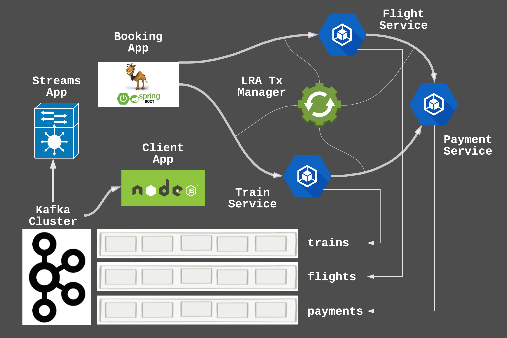
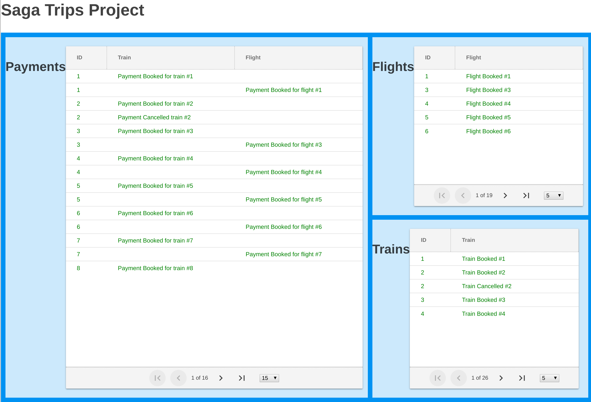
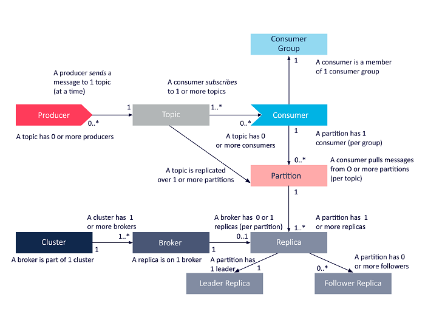
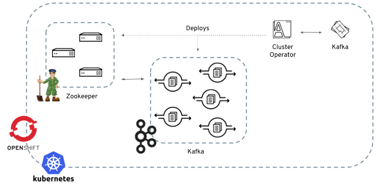
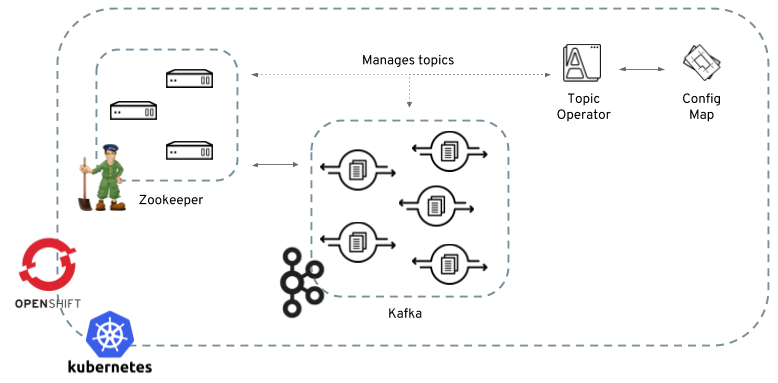

# Camel Saga with Kafka Streams

This quickstart demonstrates how to use the new saga feature of Camel 2.21 as well as using Kafka and Kafka Streams for storing and querying events.



- Saga pattern, compensating events, eventually consistent
- Synchronous MSA, REST
- CQRS, event driven async MSA
- May receive out of order cancels
- Topic partition auto by id
- Long running action, narayana transaction manager
- MSA springboot, fuse camel
- Kafka + Kafka Streams - strimzi.io
- Angular + node.js UI



#### Kafka as a Service running on Kubernetes and OpenShift

- Install Kafka
- Create Kafka Cluster

https://github.com/strimzi/strimzi#openshift





##### Create Kafka Topics



```bash
oc create -n strimzi -f - <<EOF
apiVersion: v1
kind: ConfigMap
metadata:
  name: flights
  labels:
    strimzi.io/kind: topic
    strimzi.io/cluster: my-cluster
data:
  name: flights
  partitions: "1"
  replicas: "1"
  config: |-
    {
      "retention.bytes": "1073741824",
      "retention.ms": "86400000",
      "segment.bytes": "1073741824"
    }
EOF

oc create -n strimzi -f - <<EOF
apiVersion: v1
kind: ConfigMap
metadata:
  name: trains
  labels:
    strimzi.io/kind: topic
    strimzi.io/cluster: my-cluster
data:
  name: trains
  partitions: "1"
  replicas: "1"
  config: |-
    {
      "retention.bytes": "1073741824",
      "retention.ms": "86400000",
      "segment.bytes": "1073741824"
    }
EOF

oc create -n strimzi -f - <<EOF
apiVersion: v1
kind: ConfigMap
metadata:
  name: payments
  labels:
    strimzi.io/kind: topic
    strimzi.io/cluster: my-cluster
data:
  name: payments
  partitions: "1"
  replicas: "1"
  config: |-
    {
      "retention.bytes": "1073741824",
      "retention.ms": "86400000",
      "segment.bytes": "1073741824"
    }
EOF


oc create -n strimzi -f - <<EOF
apiVersion: v1
kind: ConfigMap
metadata:
  name: trips
  labels:
    strimzi.io/kind: topic
    strimzi.io/cluster: my-cluster
data:
  name: trips
  partitions: "1"
  replicas: "1"
  config: |-
    {
      "retention.bytes": "1073741824",
      "retention.ms": "86400000",
      "segment.bytes": "1073741824"
    }
EOF
```

##### Kafka commands

```bash
oc exec -it my-cluster-zookeeper-0 -n strimzi -- bin/kafka-tpoics.sh --list --bootstrap-server=my-cluster-kafka-bootstrap:9092

oc exec -it my-cluster-zookeeper-0 -n strimzi -- bin/kafka-console-consumer.sh --bootstrap-server=my-cluster-kafka-bootstrap:9092 --from-beginning \
    --topic flights \
    --formatter kafka.tools.DefaultMessageFormatter \
    --property print.key=true \
    --property print.value=true 

oc exec -it my-cluster-zookeeper-0 -n strimzi -- bin/kafka-console-consumer.sh --bootstrap-server=my-cluster-kafka-bootstrap:9092 --from-beginning \
    --topic trains \
    --formatter kafka.tools.DefaultMessageFormatter \
    --property print.key=true \
    --property print.value=true 

oc exec -it my-cluster-zookeeper-0 -n strimzi -- bin/kafka-console-consumer.sh --bootstrap-server=my-cluster-kafka-bootstrap:9092 --from-beginning \
    --topic payments \
    --formatter kafka.tools.DefaultMessageFormatter \
    --property print.key=true \
    --property print.value=true

oc exec -it my-cluster-zookeeper-0 -n strimzi -- bin/kafka-console-consumer.sh --bootstrap-server=my-cluster-kafka-bootstrap:9092 --from-beginning \
    --topic trips \
    --formatter kafka.tools.DefaultMessageFormatter \
    --property print.key=true \
    --property print.value=true 
```

#### Deploy LRA Co-Ordinator

The upstream image may have issues. Try create a command in the template:

```
oc create -f lra-coordinator-template.yaml
oc new-app --template=lra-coordinator -e LOG_LEVEL=TRACE
```

Can deploy a manual build as well if required:

```bash
git clone git@github.com:eformat/lra-service.git
cd ~/git/lra-service/lra-coordinator
mvn clean package fabric8:deploy
```

```bash
oc create -f - <<EOF
{
  "apiVersion": "v1",
  "kind": "PersistentVolumeClaim",
  "metadata": {
    "name": "lra-data"
  },
  "spec": {
    "accessModes": [ "ReadWriteOnce" ],
    "resources": {
     "requests": {
        "storage": "1Gi"
      }
    }
  }
}
EOF
```

```bash
oc volume dc/lra-coordinator --add --overwrite -t persistentVolumeClaim --claim-name=lra-data --name=lra-data --mount-path=/deployments/data
```

#### Deploy Core Saga Applications

```bash
cd ~/git/camel-saga-quickstart
mvn clean fabric8:deploy
```

#### Deploy UI Applications

##### UI Server

```bash
oc import-image --all --insecure=true -n openshift --confirm registry.access.redhat.com/rhscl/nodejs-8-rhel7
cd ~/git/camel-saga-quickstart/realtime_ui/server
oc new-build --binary --name=ui-server -l app=ui-server -i nodejs-8-rhel7
oc start-build ui-server --from-dir=. --follow
-- -e KAFKA_URL
oc new-app ui-server
oc expose svc ui-server

```

##### UI Client

```bash
cd ~/git/camel-saga-quickstart/realtime_ui/client
oc new-build --binary --name=ui-client -l app=ui-client -i nodejs-8-rhel7
oc start-build ui-client --from-dir=. --follow
oc new-app ui-client
oc expose svc ui-client
```

##### Istio

Deploy [Istio](https://istio.io/docs/setup/kubernetes/platform-setup/openshift/) to your cluster. Then Istio'ize your apps:

```bash
oc apply -f <(istioctl kube-inject -f camel-saga-app/target/classes/META-INF/fabric8/openshift/camel-saga-app-deploymentconfig.yml)
oc apply -f <(istioctl kube-inject -f camel-saga-flight-service/target/classes/META-INF/fabric8/openshift/camel-saga-flight-service-deploymentconfig.yml)
oc apply -f <(istioctl kube-inject -f camel-saga-train-service/target/classes/META-INF/fabric8/openshift/camel-saga-train-service-deploymentconfig.yml)
oc apply -f <(istioctl kube-inject -f camel-saga-payment-service/target/classes/META-INF/fabric8/openshift/camel-saga-payment-service-deploymentconfig.yml)
oc apply -f <(istioctl kube-inject -f ~/git/lra-service/lra-coordinator/target/classes/META-INF/fabric8/openshift/lra-coordinator-deploymentconfig.yml)
``` 

#### TODO

- Cassandra CDC
- Istio (chaos, fallback, canary, slow consumers)
- Full HA replicas + partitions
- Compensating actions must succeed
- CQRS blocking read instead if sliding window
- Payload to json instead of strings
- Single replica dtx manager (narayana) is not H/A in OCP - scaling still to be supported


#### References

- https://github.com/apache/camel/blob/master/camel-core/src/main/docs/eips/saga-eip.adoc
- https://www.nicolaferraro.me/2018/04/25/saga-pattern-in-apache-camel/
- https://www.infragistics.com/community/blogs/b/infragistics/posts/four-simple-steps-to-working-with-ignite-ui-for-angular-grid-and-rest-service
- https://cwiki.apache.org/confluence/display/KAFKA/Kafka+Streams+Join+Semantics
- http://jbossts.blogspot.com/2017/12/narayana-lra-implementation-of-saga.html
